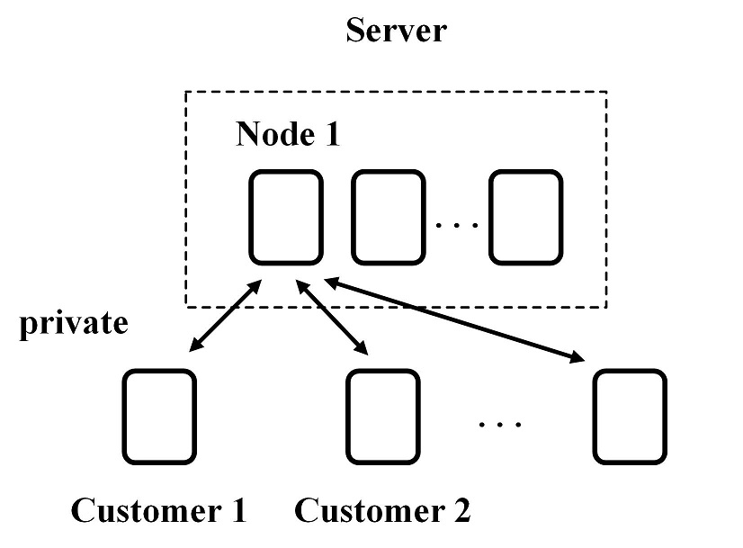

# Distributed Audit System  

## Introduction
This project provides a platform to set up a private blockchain network as a distributed audit system. Contracts of Ethereum play a role of containers in this scenario to store audit records.   
Each node in this cluster has its own identity, equipped with public and private keys to encrypte records.  
As the server, it can read encrypted audit records of all customers. It owns seven nodes to guarantee consensus mechanism to work well when customers are few. Besides, when some customers are crashed, audit data can be recovered by syncing up with the nodes left.   
As a customer, it can write and read audit data from its own contract. It only interacts with the server, independent of other customers.  
This system is equipped with several characteristics:  
  - Distribution: The whole system is decentralized without the need of a trusted authority.
  - Privacy: All data in contracts are encrypted. Besides, a customer can access to its own contract rather than others'.
  - Safety: Data stored in blockchian are immutable. 
  - Permission: If a new peer want to join the private network, it needs to apply to server for permission.  
In this document, the root path where this project locates is denoted as `$PROJ_HOME` for clarity.  

## Flowchart  


## Environment  
Operating system:  
Ubuntu 16.04  
Software version:   
golang 1.9.3, geth 1.7.2    
(These two softwares will be installed by running the script `install_dep.sh`)  

## Install dependency  
```sh
git clone https://github.com/cosimoth/Distributed_Audit.git 
cd $PROJ_HOME
sh ./init_env.sh
./install_dep.sh
```

## Compile a smart contract  
The smart contract is written in the Solidity language developed by Ethereum. Its syntax is similar to that of Java.  
We can compile a new smart contract in the Linux shell with the command tool "solc". Utilize "--bin" flag to get the binary code, "--abi" to get the ABI (Application Binary Interface), and "--gas" to estimate the gas usage, i.e.,  
```sh
solc --bin --abi --gas <Contract_Name>.sol
```
Or it can be debugged and compiled online at this [website](http://remix.ethereum.org/).  
After compiled, the ABI and binary code from the output can be used in the Java scripts (such as `./util/write_exist_contract.js` and `./util/write_new_contract.js`) to deploy a new contract instance on the blockchian, or call functions of exsisting contracts.  
Note that once an instance of a smart contract is deployed on the blockchain, it cannot be deleted or modified. If you develop a new version of contract codes, you have to deploy a new instance on the blockchain, without means to replace the former one.   

## Manage the node of Audit Team  
### Preparations   
+ Since the the node of Audit Team needs to be established on one VM in this example, it should own seven different IP addresses to start its seven nodes.   
The VM on Azure can set its IP configuration as follows:
  1. Azure -> VM -> Network Interface  
  2. Enable IP forwarding  
  3. Add IP configuration with a Static IP address  
  4. Add IP addresses to VM OS by follwing this [document](https://docs.microsoft.com/zh-cn/azure/virtual-network/virtual-network-multiple-ip-addresses-portal#os-config)   

+ Except the individual `$HOST_IP` (172.16.1.5 in this example), we suppose other six IP addresses are continuous, sharing a same `HOST_IP_BASE` (172.16.1.) and starting with a `HOST_IP_OFFSET` (9). They are all defined in `$PROJ_HOME/cluster/config-cluster.json`.  
In other words, the main IP address of Audit Team's node is `$HOST_IP` (172.16.1.5).  
And other six IP addresses are `${HOST_IP_BASE}${HOST_IP_OFFSET}` (172.16.1.9),   
`${HOST_IP_BASE}$((HOST_IP_OFFSET+1))` (172.16.1.10), ...,   
`${HOST_IP_BASE}$((HOST_IP_OFFSET+5))` (172.16.1.14), respectively.  
These configurations should be set properly in `config-cluster.json`.  

+ The settings of all ports (including `PORT`, `RPC_PORT`, `RAFT_PORT` and `CONSTE_PORT`) are not fixed. Other ports are ok if they are free. They'll be connected by nodes of Customers.  

+ We can also start the node of Audit Team on seven different VMs. In this case, each VM only need to be equipped with one IP address.  
The first node acts as a bootnode, which means other nodes are all connected with it to find other peers in the network.  
However, we need to do the following step "Start a node" for seven times， which is a little time-consuming.  

### Start a node as the Audit Team  
```sh
cd $PROJ_HOME/cluster
# Check configurations in file "./config-cluster.json", including IP addresses and ports
./init_cluster.sh
./start_cluster.sh
```

### Add a new Customer
```sh
cd $PROJ_HOME/util
# Check data directory configuration in "./config-util.json"
./run.sh -peer --add <Customer_ID>
```

### Deploy a new contract as a storage for a Customer
```sh
cd $PROJ_HOME/util
# Check data directory configuration in "./config-util.json"
# Create a new storage for a customer:
./run.sh -create <Customer_Name> <Customer_ID> <Public_Key>
```

### Read audit data
```sh
cd $PROJ_HOME/util
# Check data directory configuration in "./config-util.json"
# Read audit data:  
./run.sh -read --cust <Customer_Name>
# or
./run.sh -read --addr <Storage_Address>
```

## Manage the node of a Customer  
### Preparations 
The node of a Customer should be equipped with one IP address, which can connect to the Audit Team's node without errors.  
In `$PROJ_HOME/node/config.json`, the configurations should be set properly. `CLUSTER_IP` is the `HOST_IP` of Audit Team's node, and `CLUS_CON_PORT` corresponds to Audit Team's `CONSTE_PORT` setting.  

### Start a node as a Customer  
Generate encryption keys and identity files with a password 
```sh
cd $PROJ_HOME/node
# Check configurations in file "./config.json", including IP address and ports
./gene_key.sh

```
Then save the password in `../pw.dat`.  
After this step, there're four keys generated:  
1. Key pairs of the encryption system, stored in `$PROJ_HOME/../.qdata/con/` as `tm.pub` (public key) and `tm.key` (private key).
2. Node key as the identity of this machine, stored in the `$PROJ_HOME/../.qdata/dd/geth/nodekey` as `nodekey`. 
3. Enode URL which is used to apply to the Audit Team. It is the combination of node key along with the IP address and ports setttings of this machine, as `ENODE_NRL=enode://${NODE_KEY}@${HOST_IP}:${PORT}?discport=0&raftport=${RAFT_PORT}`.  
4. Account file as the identity of this Customer, stored in the `$PROJ_HOME/../.qdata/dd/keystore`.

### Join the network and get the storage address
Run the command (./run.sh -peer --add ...) from the output of "gene_key.sh" on the node of Audit Team.  
It adds the identity of this Customer to the membetship of the private blockchain network.  
Then a command (./start_node.sh ...) can be obtained from the output of Audit Team. Run it on the Customer node to join the as:  
```sh
cd $PROJ_HOME/node
# Check configurations in file "./config.json", including IP address and ports
./start_node.sh <RAFT_ID>
```
Run the command (./run.sh -create ...) from the output of "start_node.sh" on the node of Audit Team.   
It creates a new contract as the storage for this Customer.  
Then get the command (echo ...) from the output of Audit Team. Run it on the Customer node as:  
```sh
echo <Customer_Name> <Storage_Address> &>> ../../.qdata/.addresses.dat
```

### Write and read audit data
```sh
cd $PROJ_HOME/util
# Check data directory configuration in "./config-util.json"
# Write audit data (customer only):   
./run.sh -write <Audit_Data>
# Read audit data:  
./run.sh -read --cust <Customer_Name>
# or
./run.sh -read --addr <Storage_Address>
```

## Other tools
```sh
cd $PROJ_HOME/util
# Check data directory configuration in "./config-util.json"
# Get help:
./run.sh -help
# Show block number:
./run.sh -block
# Show peer number:
./run.sh -peer --num
```

## Stop a node 
```sh
cd $PROJ_HOME/..
killall geth constellation-node
```

## Restart a node
As the Audit Team:
```sh
cd $PROJ_HOME/cluster
./start_cluster.sh
```
As a Customer:
```sh
cd $PROJ_HOME/node
./start_node.sh <RAFT_ID>
```

## Remove data
```sh
cd $PROJ_HOME/..
rm -rf .qdata
```
